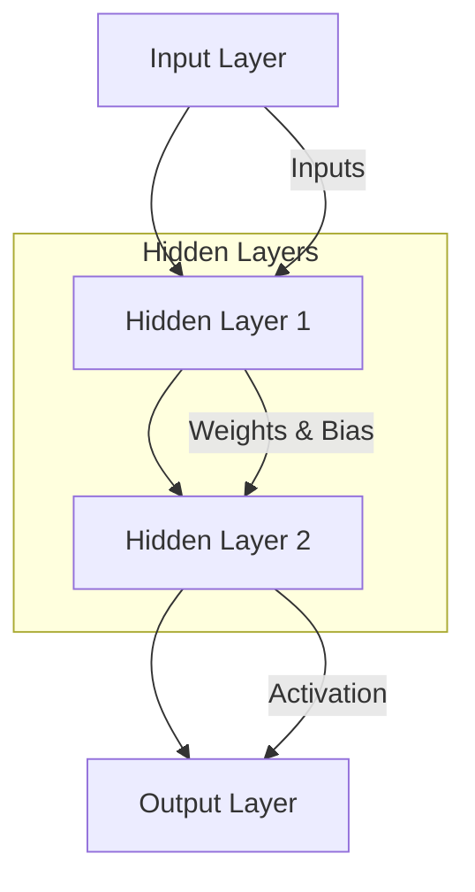

i am tanav poswal

i am a engineer

# Neural Network Flowchart

## Simple Explanation:

1. **Input Layer** - Receives data (features)
2. **Hidden Layers** - Process and learn patterns through weights & biases
3. **Output Layer** - Gives final prediction/result

### How it works:
- Inputs are multiplied by weights
- Bias is added
- Activation function decides if neuron fires
- Process repeats through all layers
